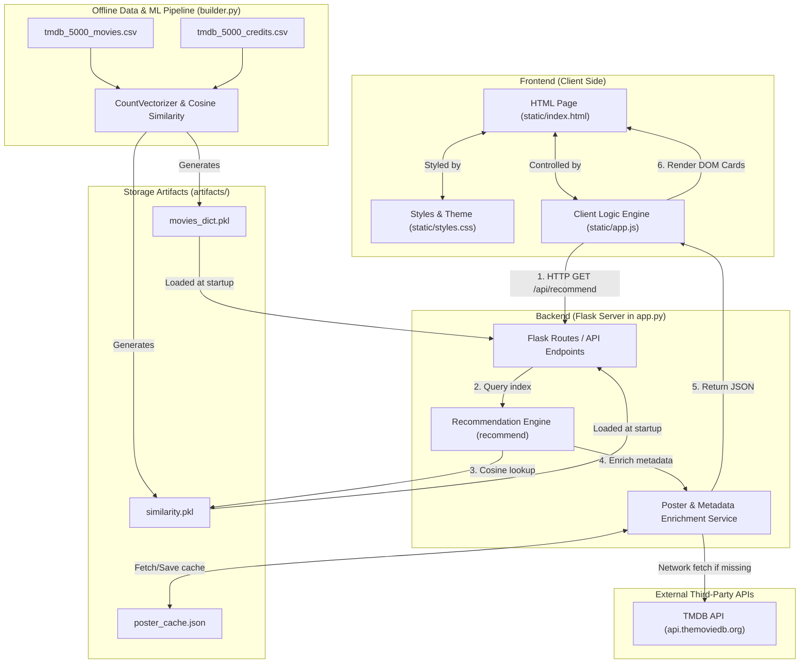

# CineMatch AI — Comprehensive Project & Architecture Guide

> **Note**: This document provides a complete technical mentor breakdown of how the Movie Recommendation System works internally, from the offline ML pipeline to the Flask backend API and Vanilla JavaScript frontend.

---

## 🏗️ High-Level System Architecture Diagram



---

## 🌐 Part 1: Frontend Flow (Web Fundamentals for Python/ML Developers)

In web development, the browser renders **HTML** for structure, **CSS** for visual styling, and **JavaScript** for dynamic behavior. Think of HTML as the skeleton, CSS as the skin and clothing, and JavaScript as the brain and nervous system.

### 1. Which frontend framework and libraries are used?
* **Framework**: **Vanilla JavaScript (ES6+)** — No heavy frameworks like React, Vue, or Angular were used. The project uses standard native browser JavaScript.
* **Libraries & Web Resources**:
  * **Google Fonts**: [Inter](https://fonts.google.com/specimen/Inter) (for crisp body text) and [Outfit](https://fonts.google.com/specimen/Outfit) (for modern headings).
  * **SVG Vector Graphics**: Inline SVG icons embedded directly in HTML/JS for lightweight, crisp UI icons (search icon, film strip icon, rating stars).

---

### 2. What is the folder structure and purpose of each folder?

```text
Movie_Recommendation_System/
├── .env                       <-- Environment variables (TMDB API key)
├── Procfile                   <-- Deployment configuration for Heroku/PaaS
├── vercel.json                <-- Deployment configuration for Vercel
├── requirements.txt           <-- Python package dependencies
├── builder.py                 <-- Offline ML data preprocessing & model builder
├── app.py                     <-- Backend Flask Web Server & API engine
├── static/                    <-- Frontend Web Assets (served directly to client)
│   ├── index.html             <-- HTML UI layout structure
│   ├── styles.css             <-- CSS styling system (colors, glassmorphism, animations)
│   └── app.js                 <-- JavaScript frontend logic (API calls, DOM updates)
└── artifacts/                 <-- Serialized ML models & cache files
    ├── movies_dict.pkl        <-- Preprocessed movie dictionary list
    ├── similarity.pkl         <-- Cosine similarity matrix (4806 x 4806)
    └── poster_cache.json      <-- Cached TMDB movie poster URLs & metadata
```

---

### 3. Which files are responsible for the UI?
1. [`static/index.html`](file:///c:/Users/rockr/OneDrive/Desktop/ML_Projects/Movie_Recommendation_System/static/index.html): Defines the layout elements (Navbar, Hero search banner, Dropdowns, Loading skeleton, Recommendations section, Catalog section, Modal popup).
2. [`static/styles.css`](file:///c:/Users/rockr/OneDrive/Desktop/ML_Projects/Movie_Recommendation_System/static/styles.css): Defines visual themes (dark mode palette, glowing orb background, glassmorphism blur effects, responsive CSS grid layouts, and card hover animations).
3. [`static/app.js`](file:///c:/Users/rockr/OneDrive/Desktop/ML_Projects/Movie_Recommendation_System/static/app.js): Dynamically manipulates the UI (hides/shows sections, injects HTML cards, updates text contents when data arrives from the backend).

---

### 4. Which file is the entry point of the frontend?
The entry point is [`static/index.html`](file:///c:/Users/rockr/OneDrive/Desktop/ML_Projects/Movie_Recommendation_System/static/index.html). When a user visits `http://127.0.0.1:5000/`, Flask serves this file ([`app.py:L286-L288`](file:///c:/Users/rockr/OneDrive/Desktop/ML_Projects/Movie_Recommendation_System/app.py#L286-L288)). At the bottom of `index.html` ([`index.html:L186`](file:///c:/Users/rockr/OneDrive/Desktop/ML_Projects/Movie_Recommendation_System/static/index.html#L186)), it loads [`static/app.js`](file:///c:/Users/rockr/OneDrive/Desktop/ML_Projects/Movie_Recommendation_System/static/app.js), which boots up the client application.

---

### 5. How routing/navigation works
The application uses a **Single Page Application (SPA)** design pattern:
* There are no separate `.html` pages or traditional server-side page reloads when navigating.
* Everything happens on `index.html`. Navigation (opening movie detail modals, showing search recommendations vs. browsing the movie catalog) works by toggling the CSS class `.hidden` on container elements via JavaScript (`element.classList.remove('hidden')` / `element.classList.add('hidden')`).

---

### 6. How state is managed
State refers to memory stored in the user's browser while using the app. In [`static/app.js`](file:///c:/Users/rockr/OneDrive/Desktop/ML_Projects/Movie_Recommendation_System/static/app.js#L38-L43), state is stored in plain JavaScript variables:
* `selectedTopNValue` (number): Tracks how many recommendations to request (e.g., 5, 8, 12, 16).
* `currentPage` (number): Tracks the active catalog page number.
* `totalCatalogPages` (number): Tracks the maximum pages available for the chosen genre/sort.
* `debounceTimer` (timer handle): Prevents sending network requests on every keystroke during typing.
* `activeMoviesMap` (`Map` object): In-memory key-value store mapping `movie_id -> movie object` so movie detail modals can instantly retrieve movie data without re-fetching.

---

### 7. How the frontend communicates with the backend
The frontend communicates asynchronously with the backend using the native browser **`fetch()` API** (similar to Python's `requests.get()`). 

JavaScript uses `async / await` syntax so the web page remains responsive and never freezes while waiting for network responses from Flask.

---

### 8. Which API endpoints are called?
The frontend calls four main Flask API routes:
1. `GET /api/stats` — Called on page load to populate genre dropdown filters ([`app.js:L51-L68`](file:///c:/Users/rockr/OneDrive/Desktop/ML_Projects/Movie_Recommendation_System/static/app.js#L51-L68)).
2. `GET /api/movies?page=1&limit=12&genre=Action&sort_by=popularity` — Called when browsing or filtering the catalog ([`app.js:L295-L323`](file:///c:/Users/rockr/OneDrive/Desktop/ML_Projects/Movie_Recommendation_System/static/app.js#L295-L323)).
3. `GET /api/search?q=Avatar&limit=6` — Called as the user types into the search bar for autocomplete ([`app.js:L163-L203`](file:///c:/Users/rockr/OneDrive/Desktop/ML_Projects/Movie_Recommendation_System/static/app.js#L163-L203)).
4. `GET /api/recommend?title=Avatar&top=5` — Called when user clicks "Recommend" to trigger the ML similarity pipeline ([`app.js:L206-L229`](file:///c:/Users/rockr/OneDrive/Desktop/ML_Projects/Movie_Recommendation_System/static/app.js#L206-L229)).

---

### 9. What request is sent to the backend?
An HTTP GET request is sent with URL query parameters. For example:
`http://127.0.0.1:5000/api/recommend?title=Interstellar&top=5`

---

### 10. What response is received from the backend?
The backend returns a **JSON response** containing target movie info and a list of recommended movies:

```json
{
  "target_movie": {
    "movie_id": 157336,
    "title": "Interstellar",
    "overview": "The adventures of a group of explorers...",
    "genres": ["Adventure", "Drama", "Science Fiction"],
    "vote_average": 8.1,
    "poster_url": "https://image.tmdb.org/t/p/w500/gEU2QniE6E77NI6lCU6MxlNBvIx.jpg"
  },
  "recommendations": [
    {
      "movie_id": 27205,
      "title": "Inception",
      "similarity_score": 0.3842,
      "match_percentage": 38,
      "vote_average": 8.1,
      "genres": ["Action", "Science Fiction", "Adventure"],
      "poster_url": "https://image.tmdb.org/t/p/w500/oYuLEW9W2vDuhhPAcXziigLjWvM.jpg"
    }
  ],
  "total_recommended": 5
}
```

---

### 11. How the response is converted into recommendation cards
1. [`app.js`](file:///c:/Users/rockr/OneDrive/Desktop/ML_Projects/Movie_Recommendation_System/static/app.js) receives the JSON object inside `fetchRecommendations()`.
2. It passes `data.target_movie` and `data.recommendations` to `displayResults()` ([`app.js:L255-L292`](file:///c:/Users/rockr/OneDrive/Desktop/ML_Projects/Movie_Recommendation_System/static/app.js#L255-L292)).
3. For each recommended movie, it calls `createMovieCard(movie, true)` ([`app.js:L326-L367`](file:///c:/Users/rockr/OneDrive/Desktop/ML_Projects/Movie_Recommendation_System/static/app.js#L326-L367)).
4. `createMovieCard()` builds an HTML structure (card poster container, match percentage pill, title, metadata badges, details/similar buttons) and appends it directly into the grid DOM node: `recommendationsGrid.appendChild(card)`.

---

### 12. How movie posters are fetched and displayed
1. **Primary TMDB Posters**: `app.py` queries the official TMDB API (`https://api.themoviedb.org/3/movie/{id}`) to obtain image paths like `/gEU2QniE6E77NI6lCU6MxlNBvIx.jpg`. It prefixes TMDB's CDN domain to build full URLs: `https://image.tmdb.org/t/p/w500/gEU2QniE6E77NI6lCU6MxlNBvIx.jpg`.
2. **Fallback Vector SVG Posters**: If no API key is set or network requests fail, `app.py` ([`app.py:L234-L279`](file:///c:/Users/rockr/OneDrive/Desktop/ML_Projects/Movie_Recommendation_System/app.py#L234-L279)) generates a customized, dynamic SVG poster encoded as a Data URI (using movie colors based on genre).
3. **Displaying**: The browser sets the `src` attribute of HTML `` elements to these poster URLs.

---

### 13. How the recommendation count dropdown works
In [`index.html:L59-L75`](file:///c:/Users/rockr/OneDrive/Desktop/ML_Projects/Movie_Recommendation_System/static/index.html#L59-L75), a custom HTML dropdown container (`#custom-top-dropdown`) is rendered with options for `Top 5`, `Top 8`, `Top 12`, and `Top 16`.

In [`app.js:L72-L87`](file:///c:/Users/rockr/OneDrive/Desktop/ML_Projects/Movie_Recommendation_System/static/app.js#L72-L87):
1. Clicking the trigger button toggles the dropdown list visibility (`dropdownMenu.classList.toggle('hidden')`).
2. Clicking an option updates `selectedTopNValue` (e.g. to `8`), updates the label text to `Top 8`, marks the item active, and closes the dropdown.
3. When the user later clicks "Recommend", `selectedTopNValue` is passed in the query parameter `?top=8`.

---

### 14. How user actions trigger backend requests
| User Action | Event Listener in JS | Function Executed | Backend API Endpoint Called |
| :--- | :--- | :--- | :--- |
| **Typing movie title** | `input` event ([`L96`](file:///c:/Users/rockr/OneDrive/Desktop/ML_Projects/Movie_Recommendation_System/static/app.js#L96)) | `fetchAutocomplete()` | `GET /api/search?q=...` |
| **Clicking "Recommend" / Pressing Enter** | `click` / `keypress` ([`L118`](file:///c:/Users/rockr/OneDrive/Desktop/ML_Projects/Movie_Recommendation_System/static/app.js#L118)) | `fetchRecommendations()` | `GET /api/recommend?title=...` |
| **Clicking Trending / Suggestion Tag** | `click` event ([`L132`](file:///c:/Users/rockr/OneDrive/Desktop/ML_Projects/Movie_Recommendation_System/static/app.js#L132)) | `fetchRecommendations()` | `GET /api/recommend?title=...` |
| **Changing Genre / Sort filter** | `change` event ([`L144`](file:///c:/Users/rockr/OneDrive/Desktop/ML_Projects/Movie_Recommendation_System/static/app.js#L144)) | `loadCatalog(1)` | `GET /api/movies?genre=...` |
| **Clicking "Similar" on movie card** | `click` event ([`L358`](file:///c:/Users/rockr/OneDrive/Desktop/ML_Projects/Movie_Recommendation_System/static/app.js#L358)) | `fetchRecommendations()` | `GET /api/recommend?title=...` |

---

### 15. How errors and loading states are handled
* **Loading State**: Before sending a `fetch()` request, [`app.js`](file:///c:/Users/rockr/OneDrive/Desktop/ML_Projects/Movie_Recommendation_System/static/app.js#L210) un-hides `#loading-state` (`classList.remove('hidden')`). This renders pulsating grey "skeleton cards" so the user knows an ML request is processing. Once data returns, the skeleton is hidden.
* **Error State**: If the movie title does not exist in the dataset (or the network fails), Flask returns an HTTP 404 status with popular movie suggestions. `app.js` catches this, un-hides `#error-container`, displays "Movie Not Found", and renders clickable tags for popular movies so the user can easily recover ([`app.js:L232-L252`](file:///c:/Users/rockr/OneDrive/Desktop/ML_Projects/Movie_Recommendation_System/static/app.js#L232-L252)).

---

### 16. How the frontend and backend are connected together
Flask acts as both the **Web Server** and the **API Backend**:
1. When you run `python app.py`, Flask starts listening on port `5000`.
2. Flask serves static frontend files (`index.html`, `styles.css`, `app.js`) directly via `send_from_directory('static', 'index.html')`.
3. When `app.js` runs in the browser, it sends HTTP requests back to the same server (`http://127.0.0.1:5000/api/...`).
4. `CORS(app)` is enabled in [`app.py:L18`](file:///c:/Users/rockr/OneDrive/Desktop/ML_Projects/Movie_Recommendation_System/app.py#L18) so cross-origin browser security restrictions will not block frontend requests.

---

## 🐍 Part 2: Backend & ML Recommendation Flow

Now let's trace how Python, Scikit-Learn, and NLP process requests behind the scenes.

```text
┌─────────────────────────────────────────────────────────────────────────────┐
│                      OFFLINE MODEL BUILDING STAGE                           │
│                              (builder.py)                                   │
│                                                                             │
│  tmdb_5000_movies.csv ──┐                                                  │
│                         ├──> Merge & Extract Tags ──> PorterStemmer         │
│  tmdb_5000_credits.csv ─┘                                 │                 │
│                                                           ▼                 │
│  similarity.pkl  <── Cosine Similarity Matrix <── CountVectorizer           │
│  movies_dict.pkl <── Preprocessed Movie Meta      (5000 max features)       │
└─────────────────────────────────────────────────────────────────────────────┘
                                   │
                                   ▼ (Loads into memory at startup)
┌─────────────────────────────────────────────────────────────────────────────┐
│                       ONLINE REQUEST HANDLING STAGE                         │
│                                (app.py)                                     │
│                                                                             │
│  HTTP GET /api/recommend?title=Avatar                                       │
│                         │                                                   │
│                         ▼                                                   │
│  recommend() ──> title_lookup["avatar"] -> Index 0                          │
│                         │                                                   │
│                         ▼                                                   │
│  similarity_matrix[0] -> Array of similarity scores vs all 4,806 movies     │
│                         │                                                   │
│                         ▼                                                   │
│  sorted(enumerate(scores))[1:6] -> Top 5 indices & scores                   │
│                         │                                                   │
│                         ▼                                                   │
│  enrich_movies_with_posters() -> Parallel TMDB Poster Fetching              │
│                         │                                                   │
│                         ▼                                                   │
│  jsonify(target_movie, recommendations) -> HTTP 200 JSON Response           │
└─────────────────────────────────────────────────────────────────────────────┘
```

---

### File 1: Offline Model Generator — [`builder.py`](file:///c:/Users/rockr/OneDrive/Desktop/ML_Projects/Movie_Recommendation_System/builder.py)
* **Purpose**: Performs Natural Language Processing (NLP) feature engineering on the TMDB dataset and builds the recommendation matrix before the web server runs.
* **Key Steps in `build_recommendation_data()`**:
  1. **Dataset Loading & Merging**: Loads `tmdb_5000_movies.csv` and `tmdb_5000_credits.csv` and merges them on `title` ([`builder.py:L25-L29`](file:///c:/Users/rockr/OneDrive/Desktop/ML_Projects/Movie_Recommendation_System/builder.py#L25-L29)).
  2. **Feature Extraction**: Extracts plot overviews, top 3 cast actors, director, genres, and keywords using Python's `ast.literal_eval` ([`builder.py:L40-L69`](file:///c:/Users/rockr/OneDrive/Desktop/ML_Projects/Movie_Recommendation_System/builder.py#L40-L69)).
  3. **Space Cleaning**: Replaces spaces in multi-word entities (e.g., `"Johnny Depp"` becomes `"JohnnyDepp"`, `"Science Fiction"` becomes `"ScienceFiction"`) so vectorization treats full names/genres as single tokens ([`builder.py:L78-L81`](file:///c:/Users/rockr/OneDrive/Desktop/ML_Projects/Movie_Recommendation_System/builder.py#L78-L81)).
  4. **Tag Combination & Text Stemming**: Combines all text metadata into a single list of tags per movie, then applies NLTK's `PorterStemmer` (e.g., `"loving"`, `"loved"`, `"loves"` all stem down to `"love"`) ([`builder.py:L83-L91`](file:///c:/Users/rockr/OneDrive/Desktop/ML_Projects/Movie_Recommendation_System/builder.py#L83-L91)).
  5. **Vectorization**: Uses Scikit-Learn's `CountVectorizer(max_features=5000, stop_words='english')` to convert movie tag strings into a sparse 2D numerical matrix of shape `(4806, 5000)` ([`builder.py:L93-L95`](file:///c:/Users/rockr/OneDrive/Desktop/ML_Projects/Movie_Recommendation_System/builder.py#L93-L95)).
  6. **Cosine Similarity**: Calculates pairwise cosine angles between all movie vectors using `cosine_similarity(vectors)`, producing a `(4806, 4806)` matrix where position `[i, j]` contains the similarity score between movie `i` and movie `j` ([`builder.py:L97-L98`](file:///c:/Users/rockr/OneDrive/Desktop/ML_Projects/Movie_Recommendation_System/builder.py#L97-L98)).
  7. **Serialization**: Saves `movies_dict.pkl` and `similarity.pkl` into the `artifacts/` folder ([`builder.py:L117-L124`](file:///c:/Users/rockr/OneDrive/Desktop/ML_Projects/Movie_Recommendation_System/builder.py#L117-L124)).

---

### File 2: Server & API Handler — [`app.py`](file:///c:/Users/rockr/OneDrive/Desktop/ML_Projects/Movie_Recommendation_System/app.py)

#### 1. Which file starts the backend?
[`app.py`](file:///c:/Users/rockr/OneDrive/Desktop/ML_Projects/Movie_Recommendation_System/app.py) starts the backend server when you run `python app.py` ([`app.py:L416-L419`](file:///c:/Users/rockr/OneDrive/Desktop/ML_Projects/Movie_Recommendation_System/app.py#L416-L419)). At startup:
* It executes `load_dotenv()` to read `TMDB_API_KEY` from `.env`.
* It calls `load_artifacts()` ([`app.py:L50-L67`](file:///c:/Users/rockr/OneDrive/Desktop/ML_Projects/Movie_Recommendation_System/app.py#L50-L67)) to unpickle `movies_dict.pkl` and `similarity.pkl` into RAM.
* It builds a fast case-insensitive lookup dictionary `title_lookup = {"avatar": 0, "pirates of the caribbean...": 1, ...}`.

#### 2. Which API receives the recommendation request?
The Flask route `@app.route('/api/recommend', methods=['GET'])` in [`app.py:L361`](file:///c:/Users/rockr/OneDrive/Desktop/ML_Projects/Movie_Recommendation_System/app.py#L361) receives the request.

#### 3. Which function is executed?
The `recommend()` function ([`app.py:L362-L414`](file:///c:/Users/rockr/OneDrive/Desktop/ML_Projects/Movie_Recommendation_System/app.py#L362-L414)) is executed.

#### 4. How the recommendation engine is called & Cosine Similarity is used:
1. `recommend()` reads `title_query = request.args.get('title')` (e.g. `"Avatar"`).
2. It looks up `"avatar"` in `title_lookup` to find the exact matrix index `target_idx` (e.g. index `0`).
3. It retrieves row `0` from the loaded matrix: `distances = similarity_matrix[target_idx]`. This row contains 4,806 float values between `0.0` and `1.0`.
4. It enumerates and sorts these scores in descending order:
   ```python
   similar_indices = sorted(list(enumerate(distances)), key=lambda x: x[1], reverse=True)[1:top_n + 1]
   ```
   *(Index `0` is skipped `[1:top_n+1]` because a movie is always 100% similar to itself!)*

#### 5. How recommendations are generated & enriched:
1. The top N positional indices are mapped back to movie dictionary records.
2. `format_movies_batch()` calls `enrich_movies_with_posters()` ([`app.py:L147-L210`](file:///c:/Users/rockr/OneDrive/Desktop/ML_Projects/Movie_Recommendation_System/app.py#L147-L210)).
3. `enrich_movies_with_posters()` checks `poster_cache.json`. If poster metadata is missing, it uses Python's `ThreadPoolExecutor` ([`app.py:L163`](file:///c:/Users/rockr/OneDrive/Desktop/ML_Projects/Movie_Recommendation_System/app.py#L163)) to make fast, parallel HTTP requests to TMDB API without slowing down the server.
4. It attaches `similarity_score` (e.g. `0.4215`) and calculates `match_percentage` (e.g. `42%`).

#### 6. How the response is returned to the frontend:
The function returns `jsonify({'target_movie': target_movie, 'recommendations': recommendations, 'total_recommended': len(recommendations)})` with an HTTP 200 OK status.

---

## 🔄 Part 3: Complete End-to-End Execution Flow

Here is the exact step-by-step lifecycle of a single user recommendation interaction:

```text
User opens website (http://127.0.0.1:5000/)
↓
Frontend loads (Flask serves index.html, styles.css, app.js; browser initializes state)
↓
User selects/types movie (e.g. "Avatar" into search input and clicks "Recommend")
↓
Frontend sends API request (app.js calls fetch('/api/recommend?title=Avatar&top=5'))
↓
Backend receives request (Flask matches route @app.route('/api/recommend') in app.py)
↓
Recommendation function executes (recommend() reads query parameters)
↓
Cosine similarity finds similar movies (Looks up title_lookup["avatar"] -> row index, sorts similarity_matrix row)
↓
Movie names & metadata generated (Top 5 movie dict objects pulled from movies_list)
↓
Poster/details are fetched (enrich_movies_with_posters checks cache or fetches TMDB API via ThreadPoolExecutor)
↓
Backend returns JSON response (app.py sends HTTP 200 JSON object back to browser)
↓
Frontend renders recommendation cards (app.js hides skeleton loader, passes JSON to createMovieCard(), and updates grid DOM)
```

---

## 📋 Summary Checklist of Key Files

* [`app.py`](file:///c:/Users/rockr/OneDrive/Desktop/ML_Projects/Movie_Recommendation_System/app.py): Backend web server, API routes (`/api/recommend`, `/api/search`, `/api/movies`), TMDB metadata fetcher, poster cache manager.
* [`builder.py`](file:///c:/Users/rockr/OneDrive/Desktop/ML_Projects/Movie_Recommendation_System/builder.py): Offline dataset processing, tag extraction, NLTK Porter Stemming, Scikit-Learn CountVectorizer, and Cosine Similarity calculation.
* [`static/index.html`](file:///c:/Users/rockr/OneDrive/Desktop/ML_Projects/Movie_Recommendation_System/static/index.html): HTML skeleton containing search controls, custom dropdowns, skeleton loader, target movie banner, recommendations grid, and details modal.
* [`static/app.js`](file:///c:/Users/rockr/OneDrive/Desktop/ML_Projects/Movie_Recommendation_System/static/app.js): Client-side JavaScript handling user event listeners, debounced search autocomplete, fetch requests, state variables, and dynamic DOM rendering.
* [`static/styles.css`](file:///c:/Users/rockr/OneDrive/Desktop/ML_Projects/Movie_Recommendation_System/static/styles.css): CSS design system providing dark mode themes, glassmorphism cards, glowing ambient background orbs, responsive grid, and smooth hover animations.
